```mermaid
flowchart TB
    subgraph current["UnTaskAlert.csproj"]
        MAIN["<b>📦&nbsp;UnTaskAlert.csproj</b><br/><small>net9.0</small>"]
        click MAIN "#untaskalertcsproj"
    end

```

# Projects and dependencies analysis

This document provides a comprehensive overview of the projects and their dependencies in the context of upgrading to .NETCoreApp,Version=v10.0.

## Table of Contents

- [Executive Summary](#executive-Summary)
  - [Highlevel Metrics](#highlevel-metrics)
  - [Projects Compatibility](#projects-compatibility)
  - [Package Compatibility](#package-compatibility)
  - [API Compatibility](#api-compatibility)
- [Aggregate NuGet packages details](#aggregate-nuget-packages-details)
- [Top API Migration Challenges](#top-api-migration-challenges)
  - [Technologies and Features](#technologies-and-features)
  - [Most Frequent API Issues](#most-frequent-api-issues)
- [Projects Relationship Graph](#projects-relationship-graph)
- [Project Details](#project-details)

  - [UnTaskAlert.csproj](#untaskalertcsproj)

## Executive Summary

### Highlevel Metrics

| Metric | Count | Status |
| :--- | :---: | :--- |
| Total Projects | 1 | All require upgrade |
| Total NuGet Packages | 16 | 5 need upgrade |
| Total Code Files | 48 |  |
| Total Code Files with Incidents | 6 |  |
| Total Lines of Code | 3192 |  |
| Total Number of Issues | 27 |  |
| Estimated LOC to modify | 20+ | at least 0,6% of codebase |

### Projects Compatibility

| Project | Target Framework | Difficulty | Package Issues | API Issues | Est. LOC Impact | Description |
| :--- | :---: | :---: | :---: | :---: | :---: | :--- |
| [UnTaskAlert.csproj](#untaskalertcsproj) | net9.0 | 🟢 Low | 5 | 20 | 20+ | AzureFunctions, Sdk Style = True |

### Package Compatibility

| Status | Count | Percentage |
| :--- | :---: | :---: |
| ✅ Compatible | 11 | 68,8% |
| ⚠️ Incompatible | 0 | 0,0% |
| 🔄 Upgrade Recommended | 5 | 31,3% |
| ***Total NuGet Packages*** | ***16*** | ***100%*** |

### API Compatibility

| Category | Count | Impact |
| :--- | :---: | :--- |
| 🔴 Binary Incompatible | 0 | High - Require code changes |
| 🟡 Source Incompatible | 4 | Medium - Needs re-compilation and potential conflicting API error fixing |
| 🔵 Behavioral change | 16 | Low - Behavioral changes that may require testing at runtime |
| ✅ Compatible | 4577 |  |
| ***Total APIs Analyzed*** | ***4597*** |  |

## Aggregate NuGet packages details

| Package | Current Version | Suggested Version | Projects | Description |
| :--- | :---: | :---: | :--- | :--- |
| Flurl.Http | 4.0.2 |  | [UnTaskAlert.csproj](#untaskalertcsproj) | ✅Compatible |
| Microsoft.Azure.Cosmos | 3.52.1 |  | [UnTaskAlert.csproj](#untaskalertcsproj) | ✅Compatible |
| Microsoft.Azure.Functions.Worker | 2.0.0 | 2.51.0 | [UnTaskAlert.csproj](#untaskalertcsproj) | NuGet package upgrade is recommended |
| Microsoft.Azure.Functions.Worker.Extensions.CosmosDB | 4.12.0 | 4.14.0 | [UnTaskAlert.csproj](#untaskalertcsproj) | NuGet package upgrade is recommended |
| Microsoft.Azure.Functions.Worker.Extensions.Http | 3.3.0 |  | [UnTaskAlert.csproj](#untaskalertcsproj) | ✅Compatible |
| Microsoft.Azure.Functions.Worker.Extensions.Http.AspNetCore | 2.0.2 | 2.1.0 | [UnTaskAlert.csproj](#untaskalertcsproj) | NuGet package upgrade is recommended |
| Microsoft.Azure.Functions.Worker.Extensions.Timer | 4.3.1 |  | [UnTaskAlert.csproj](#untaskalertcsproj) | ✅Compatible |
| Microsoft.Azure.Functions.Worker.Sdk | 2.0.5 | 2.0.7 | [UnTaskAlert.csproj](#untaskalertcsproj) | NuGet package upgrade is recommended |
| Microsoft.IdentityModel.JsonWebTokens | 8.13.0 |  | [UnTaskAlert.csproj](#untaskalertcsproj) | ✅Compatible |
| Microsoft.TeamFoundationServer.Client | 19.225.1 |  | [UnTaskAlert.csproj](#untaskalertcsproj) | ✅Compatible |
| Microsoft.VisualStudio.Services.Client | 19.225.1 |  | [UnTaskAlert.csproj](#untaskalertcsproj) | ✅Compatible |
| Microsoft.VisualStudio.Services.InteractiveClient | 19.225.1 |  | [UnTaskAlert.csproj](#untaskalertcsproj) | ✅Compatible |
| System.Data.SqlClient | 4.9.0 |  | [UnTaskAlert.csproj](#untaskalertcsproj) | ✅Compatible |
| System.Formats.Asn1 | 9.0.7 | 10.0.1 | [UnTaskAlert.csproj](#untaskalertcsproj) | NuGet package upgrade is recommended |
| System.IdentityModel.Tokens.Jwt | 8.13.0 |  | [UnTaskAlert.csproj](#untaskalertcsproj) | ✅Compatible |
| Telegram.Bot | 22.6.0 |  | [UnTaskAlert.csproj](#untaskalertcsproj) | ✅Compatible |

## Top API Migration Challenges

### Technologies and Features

| Technology | Issues | Percentage | Migration Path |
| :--- | :---: | :---: | :--- |

### Most Frequent API Issues

| API | Count | Percentage | Category |
| :--- | :---: | :---: | :--- |
| T:System.Uri | 6 | 30,0% | Behavioral Change |
| M:System.Uri.#ctor(System.String) | 6 | 30,0% | Behavioral Change |
| M:System.TimeSpan.FromHours(System.Int32) | 3 | 15,0% | Source Incompatible |
| M:System.TimeSpan.FromSeconds(System.Int64) | 1 | 5,0% | Source Incompatible |
| P:System.Uri.AbsolutePath | 1 | 5,0% | Behavioral Change |
| M:Microsoft.Extensions.DependencyInjection.HttpClientFactoryServiceCollectionExtensions.AddHttpClient(Microsoft.Extensions.DependencyInjection.IServiceCollection) | 1 | 5,0% | Behavioral Change |
| M:Microsoft.Extensions.Logging.ConsoleLoggerExtensions.AddConsole(Microsoft.Extensions.Logging.ILoggingBuilder) | 1 | 5,0% | Behavioral Change |
| T:Microsoft.Extensions.Hosting.HostBuilder | 1 | 5,0% | Behavioral Change |

## Projects Relationship Graph

Legend:
📦 SDK-style project
⚙️ Classic project

```mermaid
flowchart LR
    P1["<b>📦&nbsp;UnTaskAlert.csproj</b><br/><small>net9.0</small>"]
    click P1 "#untaskalertcsproj"

```

## Project Details

### UnTaskAlert.csproj

#### Project Info

- **Current Target Framework:** net9.0
- **Proposed Target Framework:** net10.0
- **SDK-style**: True
- **Project Kind:** AzureFunctions
- **Dependencies**: 0
- **Dependants**: 0
- **Number of Files**: 49
- **Number of Files with Incidents**: 6
- **Lines of Code**: 3192
- **Estimated LOC to modify**: 20+ (at least 0,6% of the project)

#### Dependency Graph

Legend:
📦 SDK-style project
⚙️ Classic project

### API Compatibility

| Category | Count | Impact |
| :--- | :---: | :--- |
| 🔴 Binary Incompatible | 0 | High - Require code changes |
| 🟡 Source Incompatible | 4 | Medium - Needs re-compilation and potential conflicting API error fixing |
| 🔵 Behavioral change | 16 | Low - Behavioral changes that may require testing at runtime |
| ✅ Compatible | 4577 |  |
| ***Total APIs Analyzed*** | ***4597*** |  |

